# Active Directory Home Lab

Built a virtual Windows domain environment to practice the account management, networking, and troubleshooting tasks handled by IT help desk and system administration teams.

---

**Highlights:**
- Windows Server 2025 domain controller running AD DS, DNS (forward and reverse zones), DHCP, and NAT routing on VMware Workstation Pro
- Isolated `10.10.10.0/24` corporate network with a Windows 11 client receiving its configuration from the DC's DHCP scope
- Regional OU structure (USA, Europe, Asia) with naming conventions for computers and servers, plus security and distribution groups
- Group Policy for password and lockout rules, USB blocking, drive mappings, and Control Panel restrictions, with security filtering to exempt the IT group
- Troubleshot and documented real issues: GPO link precedence, DNS registration on a dual-homed DC, and safely renaming a promoted DC with `netdom`
- File share mapped by Group Policy, with FSRM file screening that blocks and logs restricted file types

---

**Tools:** Windows Server 2025 · Windows 11 Pro · Active Directory Domain Services · DNS · DHCP · RAS/NAT · PowerShell · VMware Workstation

---

## Network Diagram

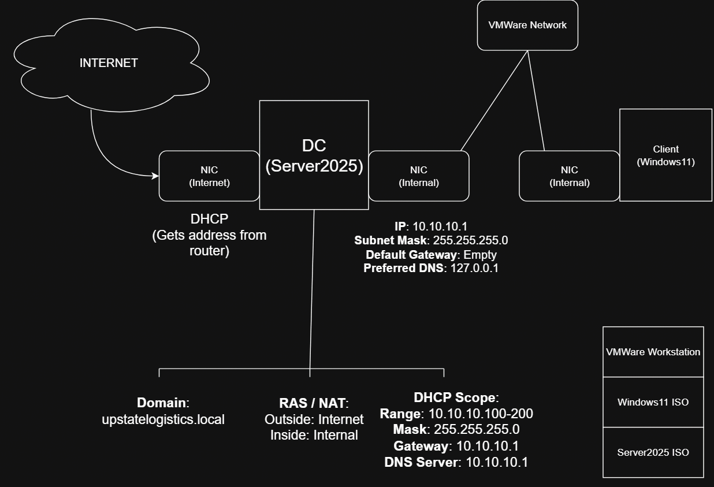

<!-- Make this in draw.io (free). Show: Internet → DC01 (NIC 1: NAT) → DC01 (NIC 2: Internal, 172.16.0.1) → USA-IT-WS01 (DHCP address) -->

| Machine | Role | Network | IP |
|---|---|---|---|
| USA-DC01 | Domain controller, DNS, DHCP, NAT router | NAT + Internal | 10.10.10.1 (internal, static) |
| USA-IT-WS01 | Domain-joined workstation | Internal only | Assigned by DHCP |

**Domain:** `upstatelogistics.local`

---

### VM Network Configuration

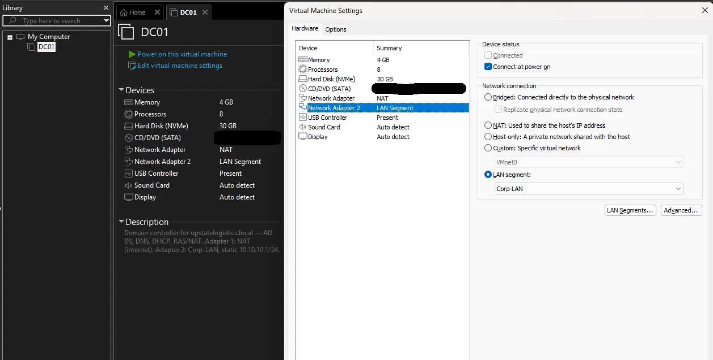

USA-DC01 has two network adapters: NAT for internet access, and Network Adapter 2 on the `Corp-LAN` LAN segment, an isolated network with no VMware DHCP, so the domain controller is the only DHCP server clients see.

I chose a LAN segment instead of Host-only because VMware's Host-only network runs its own DHCP server, which would conflict with the DC's DHCP.

---

### USA-DC01 IP Configuration

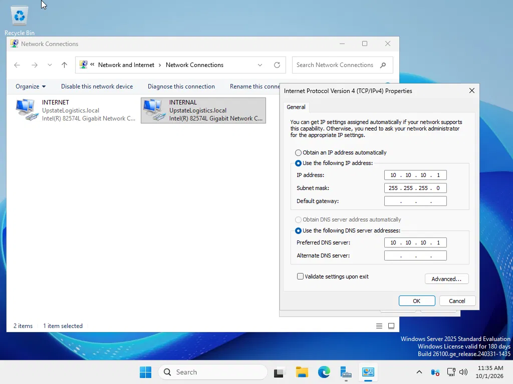

| Adapter | Purpose | Configuration |
|---|---|---|
| INTERNET | Internet access via VMware NAT | DHCP (assigned by VMware) |
| INTERNAL | Corp-LAN domain network | Static: 10.10.10.1/24, no gateway, DNS 10.10.10.1 |

I renamed both adapters so it's clear which is which. The internal adapter has no default gateway because internet traffic leaves through the separate NAT adapter, and DNS points to DC01 itself since it hosts DNS for the domain.

---

## What I Built

1. **Created two virtual machines** in VMware Workstation: a server with two network adapters (internet-facing NAT and a private internal network) and a client on the internal network only.
2. **Installed Windows Server**, assigned a static IP to the internal adapter, and renamed the machine.
3. **Installed Active Directory Domain Services** and promoted the server to a domain controller for a new forest.
4. **Created a domain admin account** and organized accounts into Organizational Units (OUs).
5. **Configured RAS/NAT** so internal clients reach the internet through the domain controller.
6. **Configured DHCP** with a scope for the internal network so clients receive addresses automatically.
7. **Bulk-created 1,000+ users** with a PowerShell script (see [`scripts/`](scripts/)).
8. **Joined the Windows client to the domain** and logged in as a created domain user.


---

## Help Desk Scenarios Practiced

<!-- Fill this in after the video. This section is what makes your lab stand out. Delete any you didn't do. -->

| Ticket | What I did |
|---|---|
| User forgot password | Reset the password in ADUC and required a change at next logon |
| Account locked out | Unlocked the account and reviewed the lockout policy |
| Employee left the company | Disabled the account and moved it to a "Disabled Users" OU |
| User can't access shared folder | Created a security group, added the user, and set NTFS/share permissions |
| Client can't reach the internet | Diagnosed with `ipconfig`, `ping`, and `nslookup`; found and fixed the misconfiguration |

### Group Policy

### Domain Password Policy

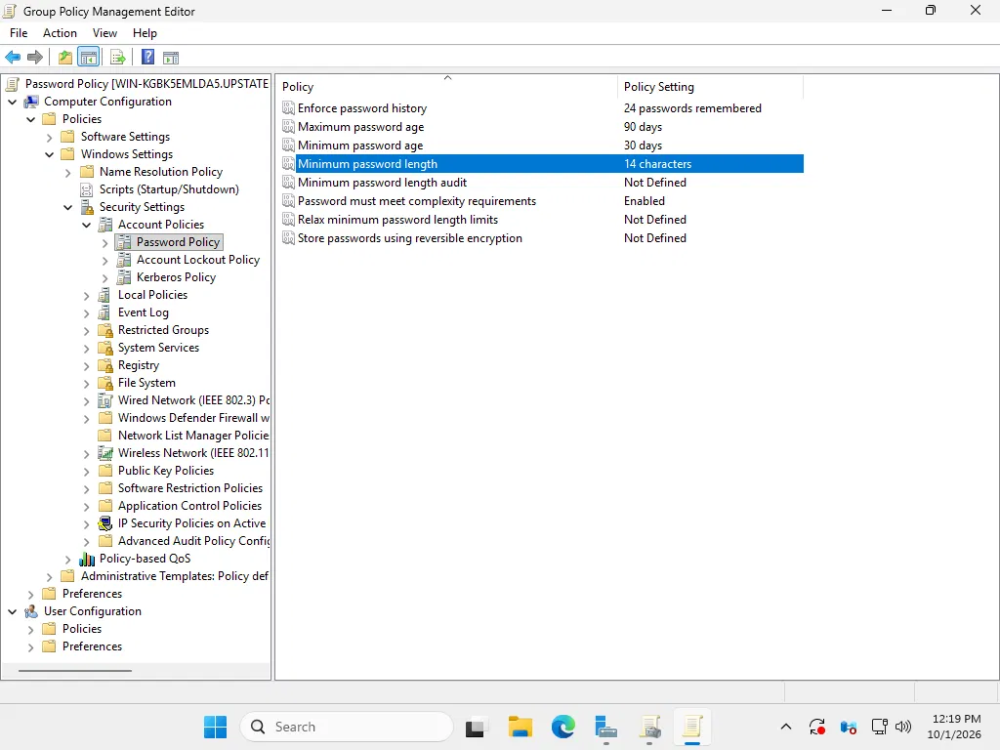

| Setting | Value |
|---|---|
| Minimum password length | 14 characters |
| Password complexity | Enabled |
| Enforce password history | 24 passwords |
| Maximum password age | 90 days |
| Minimum password age | 1 day |

**Why it's linked at the domain root:** account policies (password and lockout settings) only apply to domain user accounts when the GPO is linked at the domain level. Linked to an OU, they would have no effect on domain logins. The GPO is set above Default Domain Policy in link order so its settings take precedence.

**Verified:** `gpupdate /force` followed by `net accounts` on USA-DC01 confirms both the password and lockout policies are in effect.

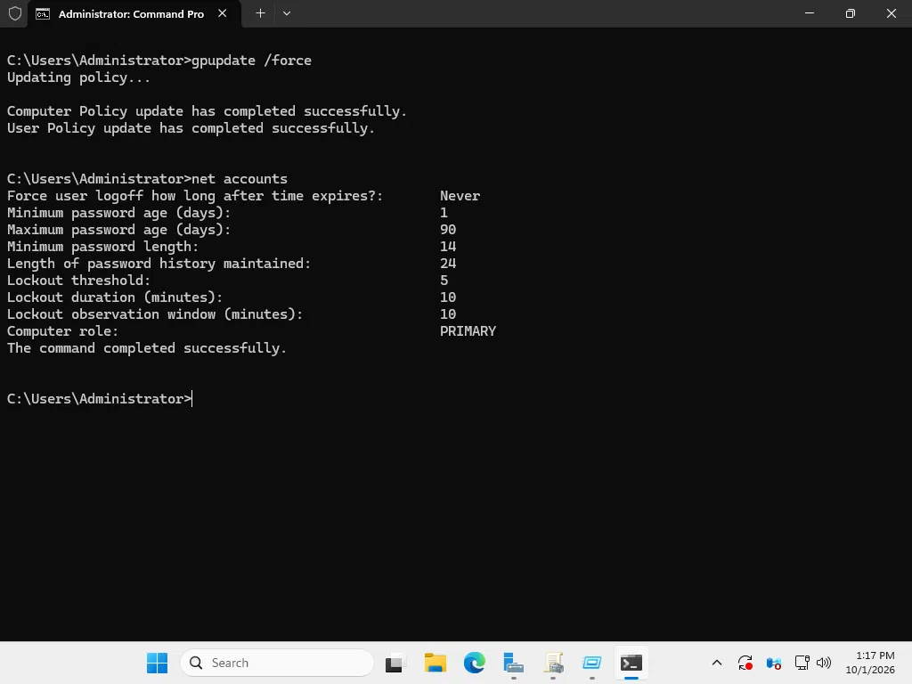

**Testing:** I confirmed the policy applies by setting a password under 14 characters on a test user, which Windows rejected.

---

## File Sharing and File Screening

### Shared Folder

Created `C:\Shared` on USA-DC01 and shared it as `\\USA-DC01\Shared`. Share permissions allow Domain Users **Change**, with NTFS permissions controlling access to individual files and folders. The share is mapped automatically as **S:** through the Mapped Drives GPO.

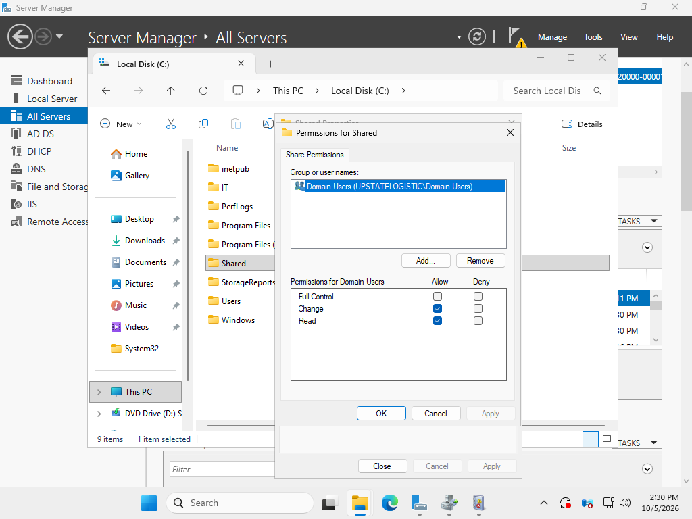

### File Screen (FSRM)

Installed File Server Resource Manager and created a file screen on `C:\Shared` that blocks audio and video files, with blocked attempts logged to the Event Log.

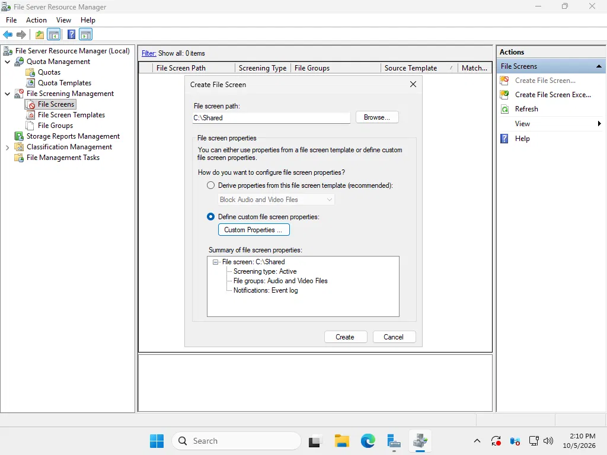

**Testing:** As gjones, a text file saved normally, but renaming it to `test.mp3` was denied.

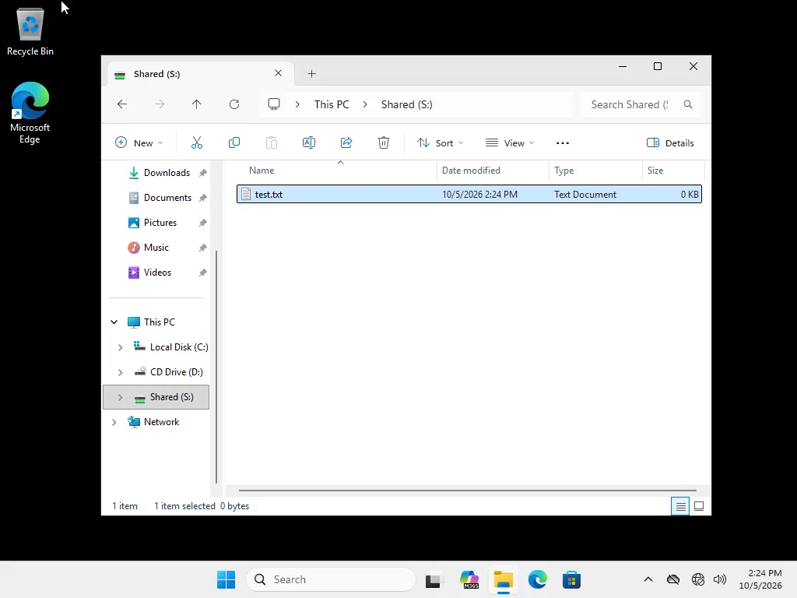
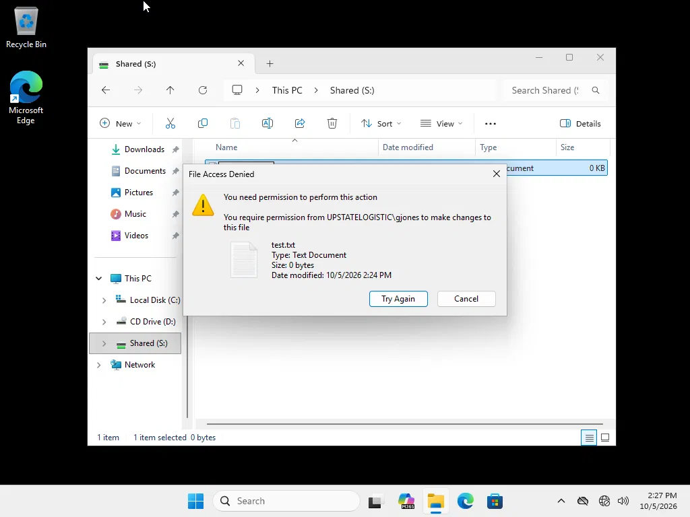

FSRM logged event 8215 identifying the user, file, and file group that triggered the block.

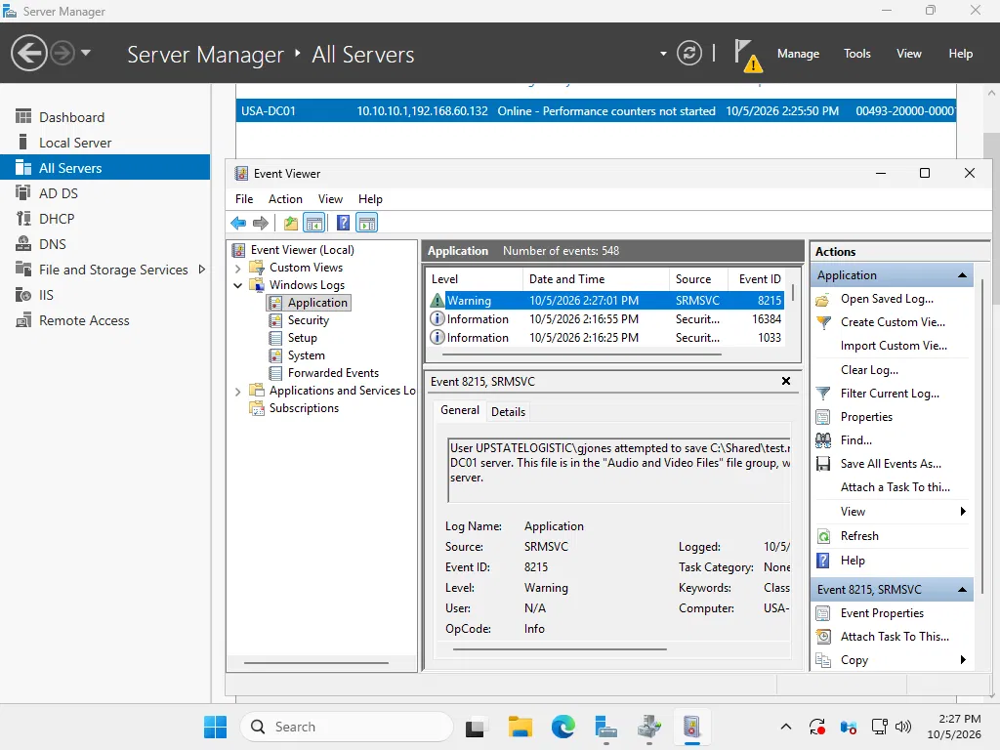

---

## Problems I Ran Into

### Password policy wasn't taking effect

**Problem:** After creating a Password Policy GPO with a 14-character minimum, the domain was still enforcing the default 7-character minimum.

**Cause:** Default Domain Policy was at link order 1 on the domain, giving it the highest precedence. It defines its own password settings by default, so it overrode my Password Policy GPO.

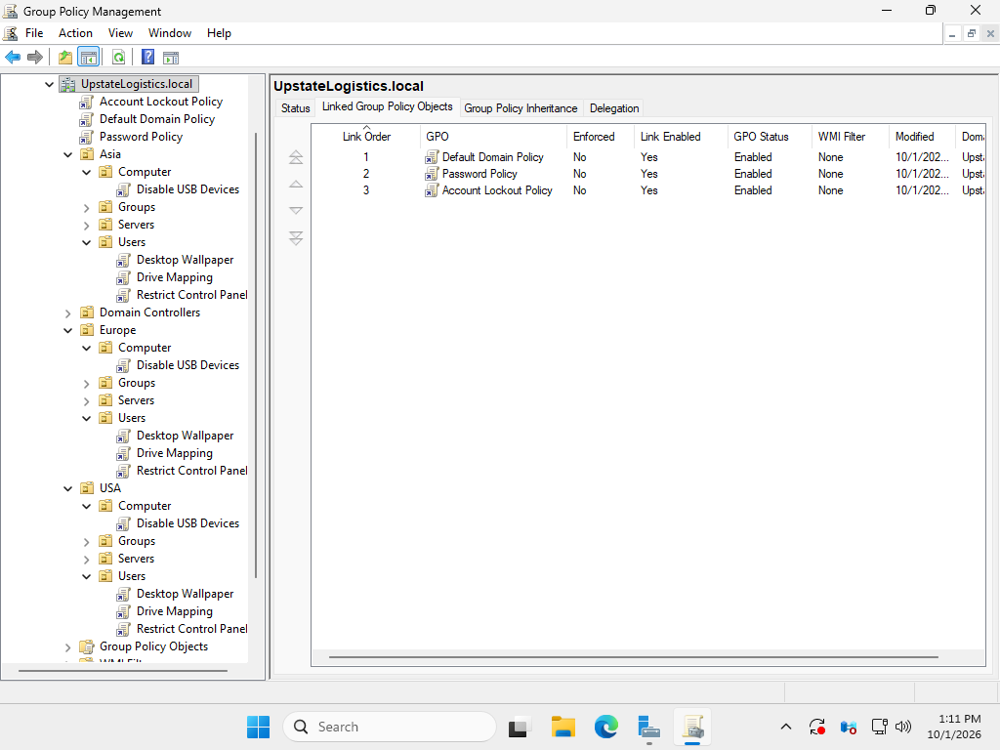

**Fix:** Moved Password Policy and Account Lockout Policy above Default Domain Policy in the link order, then ran `gpupdate /force` on USA-DC01.

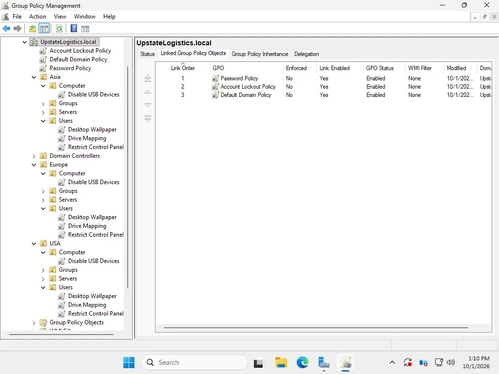

**Verified:** `net accounts` on USA-DC01 now reports a minimum password length of 14.

**Lesson:** In Group Policy, the lowest link order number wins when GPOs define the same setting. Creating a GPO isn't enough — its precedence matters.

### Client couldn't sign in: "domain isn't available"

**Problem:** USA-IT-WS01 joined the domain successfully, but domain user sign-ins failed.

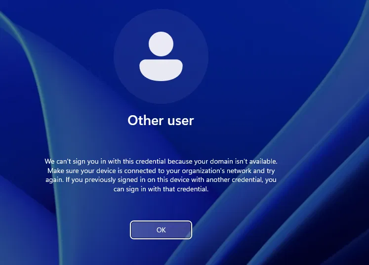

**Cause:** USA-DC01 has two network adapters, and Windows registered both IP addresses in DNS. Clients were sometimes given the NAT-side 192.168.60.x address, which isn't reachable from Corp-LAN, so they couldn't find the domain controller.

**Fix (on USA-DC01):**
- Disabled "Register this connection's addresses in DNS" on the INTERNET adapter
- Set the DNS server to listen only on 10.10.10.1 (DNS Manager → server Properties → Interfaces)
- Deleted the stale 192.168.60.x A records from the upstatelogistics.local zone
- Ran `ipconfig /flushdns`, `ipconfig /registerdns`, and restarted the Netlogon service

**Verified:** `nslookup upstatelogistics.local` on the client now returns only 10.10.10.1, and domain users can sign in.

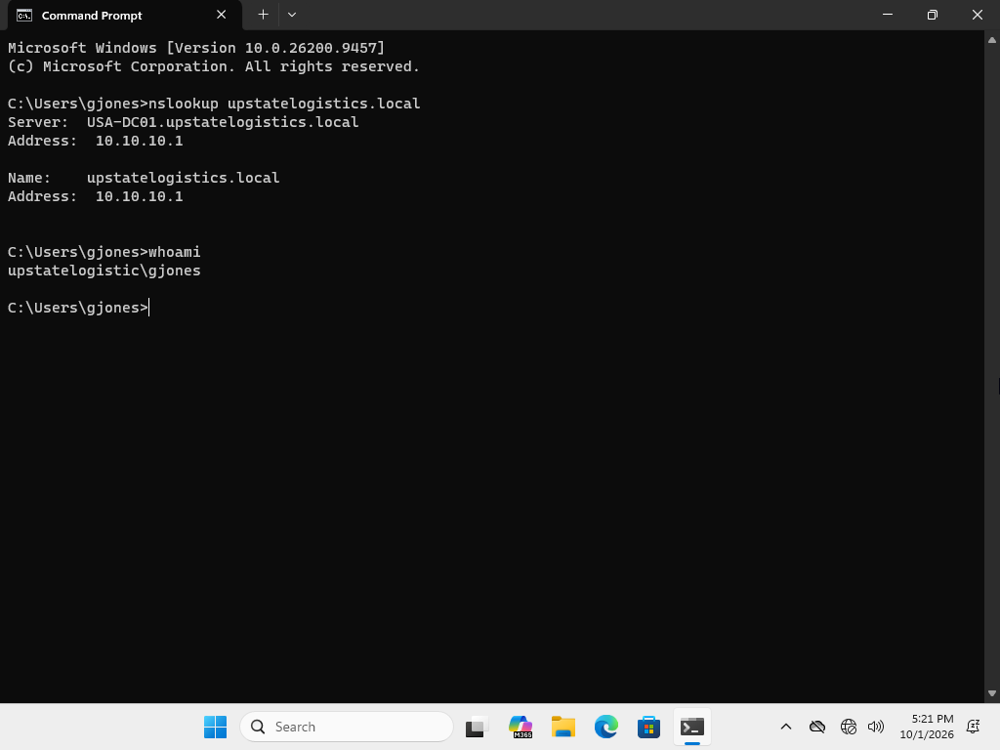

**Lesson:** On a domain controller with more than one network adapter, only the internal interface should be registered in DNS. Otherwise clients may be directed to an address they can't reach.

### Client lost its IP address after renaming the DC

**Problem:** USA-IT-WS01 fell back to a 169.254.32.209 address and couldn't reach the domain controller. `gpupdate` failed due to lack of connectivity.

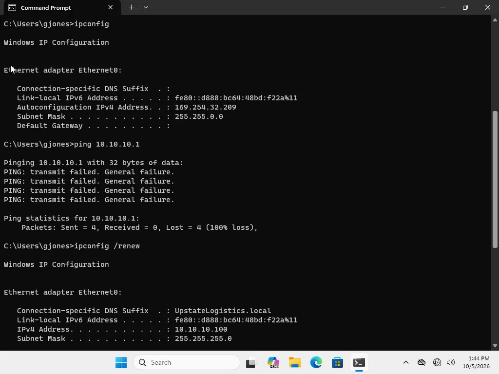

**Cause:** Renaming the DC reset the DHCP server's authorization in Active Directory. The DHCP service logged Event 1046 (not authorized to start) and stopped handing out addresses.

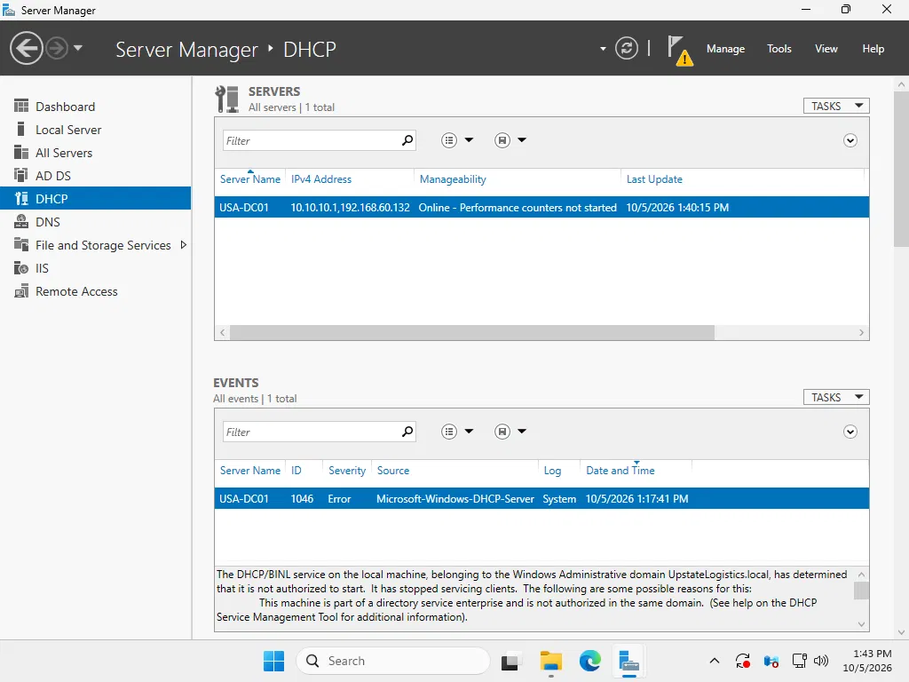

**Fix:** Completed the DHCP post-deployment configuration to re-authorize the server under its new name, then ran `ipconfig /renew` on the client.

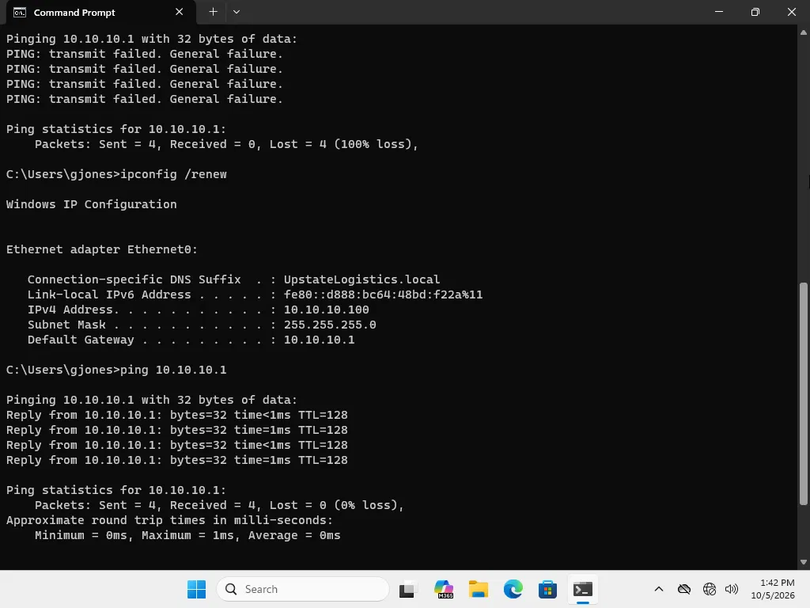

**Lesson:** DHCP authorization is tied to the server's name in AD. After renaming a DHCP server, re-authorize it and check the event log.

### "Access denied" came from the wrong layer

**Problem:** While testing the file screen, saving any file to S: was denied — not just audio and video files.

**Cause:** The share permissions gave Domain Users only Read access, so all writes were refused before FSRM ever evaluated the file. Event Viewer showed no FSRM event (8215), which pointed to the share permissions instead.

**Fix:** Changed the share permission for Domain Users to Change. Text files then saved normally, and only `.mp3` files were blocked by FSRM, with event 8215 logged.

**Lesson:** An "access denied" message doesn't say which layer denied access. Check share permissions, NTFS permissions, and FSRM separately, and use the event log to confirm.

---

## What I Learned

- How AD DS, DNS, and DHCP depend on each other, and why clients must use the DC for DNS
- How GPO link order determines which settings win when policies conflict
- Why account policies only apply to domain users when linked at the domain root
- Why a dual-homed domain controller should only register its internal IP in DNS
- How to safely rename a domain controller after promotion with `netdom`

---

## Next Steps

- [ ] Add a ticketing system (osTicket) and log lab tickets against it
- [ ] Add a second domain controller for redundancy
- [ ] Explore AD security basics (auditing logons, reviewing event logs)

---

## Credit

- Initial build and user creation script based on [Josh Madakor's Active Directory home lab tutorial](https://www.youtube.com/watch?v=MHsI8hJmggI).
- Group Policy and help desk scenarios guided by [East Charmer's Windows Server Home Lab Project](https://www.youtube.com/playlist?list=PLAdEnQWAAbfXMY2D4HVZOe-ChfTKmaJfQ).

The network design, OU structure, naming conventions, VMware adaptation, and troubleshooting documented above are my own.

## OU Structure and Groups

I organized the domain by region so that users, computers, and groups can be managed and targeted with Group Policy per location.

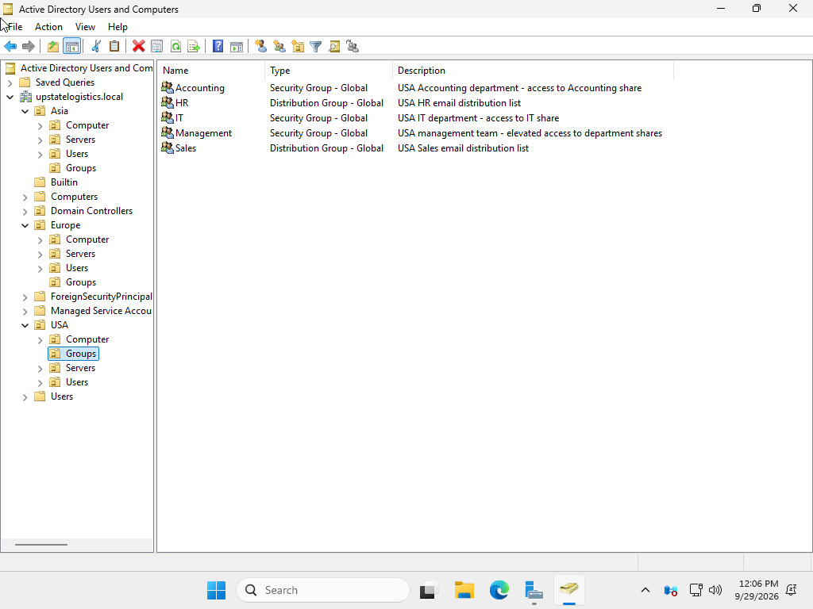

```
upstatelogistics.local
├── Asia
│   ├── Computer
│   ├── Groups
│   ├── Servers
│   └── Users
├── Europe
│   ├── Computer
│   ├── Groups
│   ├── Servers
│   └── Users
└── USA
    ├── Computer
    ├── Groups
    ├── Servers
    └── Users
```

### USA Groups

| Group | Type | Purpose |
|---|---|---|
| Accounting | Security – Global | Access to Accounting share |
| IT | Security – Global | Access to IT share |
| Management | Security – Global | Elevated access to department shares |
| HR | Distribution – Global | HR email distribution list |
| Sales | Distribution – Global | Sales email distribution list |

**Why this design:**
- **Security groups** control permissions, so access is granted to a group once instead of user by user.
- **Distribution groups** are used only for email lists and can't be assigned permissions.
- **OUs by region** make it possible to apply different Group Policies to each location.
- **OUs are protected from accidental deletion**, which I had to temporarily disable to reorganize the structure.

### Computer Naming Convention

Computers follow a `REGION-DEPT-TYPE##` format, and servers follow `REGION-ROLE##`, both kept within Windows' 15-character limit:

| Example | Meaning |
|---|---|
| `USA-IT-WS01` | USA, IT department, workstation #1 |
| `USA-DC01` | USA, domain controller #1 |

Other regions and departments follow the same pattern (e.g., `EU-SALES-WS01`, `ASIA-DC01`).

New computers are moved from the default Computers container into their region's Computer OU after joining the domain.
